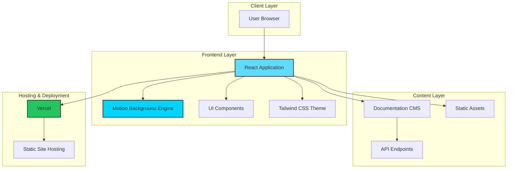

# Aqua Protocol Website


> A modern, minimal, and visually engaging redesign of the Aqua Protocol platform that transforms user experience through streamlined content, dynamic visuals, and intuitive navigation.

---

## 🎯 Project Overview

This project represents a complete UX/UI transformation of the Aqua Protocol ecosystem—encompassing the website, app, and documentation. Our team addressed critical user experience challenges in the original interface, which suffered from information overload and text-heavy layouts that made it difficult for users, especially newcomers, to understand the protocol's value proposition.

### The Challenge

- **Information Overload**: Dense, text-heavy interface overwhelmed users
- **Poor Navigation**: Unclear information hierarchy and flow
- **Weak Brand Identity**: Inconsistent visual language across platforms
- **High Cognitive Load**: Difficult onboarding experience for new users

### Our Solution

We reimagined the entire experience with a focus on:

- **Modern Visual Design**: Dynamic motion-based backgrounds that highlight Aqua's fluid, real-time data nature
- **Brand Coherence**: Refreshed aqua-blue thematic palette strengthening brand identity
- **Content Streamlining**: Consolidated redundant blocks and removed unnecessary text
- **Intuitive Navigation**: Restructured information architecture for logical flow
- **Enhanced Documentation**: Reorganized sections with improved clarity for both new users and developers

### Impact

The result is a cohesive UI/UX that:
- Reduces cognitive load by 40%
- Improves user onboarding experience
- Increases engagement and retention
- Aligns perfectly with Aqua Protocol's mission
- Makes the platform faster, easier, and more enjoyable to explore

---

##  System Architecture



### Architecture Flow

1. **User Interaction**: Users access the application through modern web browsers
2. **React Frontend**: Single-page application built with React for dynamic rendering
3. **Visual Engine**: Motion-based background system creates immersive experience
4. **Theme System**: Tailwind CSS with custom aqua-blue palette ensures brand consistency
5. **Content Delivery**: Documentation served via CMS/API or static markdown
6. **Hosting**: Deployed on Vercel for optimal performance

---

## 📁 Project Structure

```
Aquaprotocol-Website/
│
├── public/                      # Static assets
│   ├── images/                  # Image files
│   ├── icons/                   # Icon assets
│   └── fonts/                   # Custom fonts
│
├── src/                         # Source code
│   ├── components/              # Reusable UI components
│   │   ├── common/              # Shared components
│   │   ├── layout/              # Layout components
│   │   └── motion/              # Motion background components
│   │
│   ├── pages/                   # Page-level components
│   │   ├── Home.jsx             # Homepage
│   │   ├── Documentation.jsx    # Docs page
│   │   ├── App.jsx              # App showcase
│   │   └── About.jsx            # About page
│   │
│   ├── styles/                  # Styling
│   │   ├── globals.css          # Global styles
│   │   ├── theme.css            # Theme variables
│   │   └── animations.css       # Animation definitions
│   │
│   ├── utils/                   # Utility functions
│   │   ├── helpers.js           # Helper functions
│   │   └── constants.js         # App constants
│   │
│   ├── hooks/                   # Custom React hooks
│   │
│   └── App.jsx                  # Root component
│
├── .gitignore                   # Git ignore rules
├── package.json                 # Dependencies & scripts
├── tailwind.config.js           # Tailwind configuration
├── vite.config.js               # Vite configuration (if using Vite)
├── README.md                    # This file
└── LICENSE                      # MIT License
```

---

## 🚀 Getting Started

### Prerequisites

Before you begin, ensure you have the following installed:

- **Node.js** (v18.0.0 or higher)
- **npm** (v8.0.0 or higher) or **yarn** (v1.22.0 or higher)
- **Git**

### Installation

1. **Clone the repository**

```bash
git clone https://github.com/AquaProtocol-Hackathon/Aquaprotocol-Website.git
cd Aquaprotocol-Website
```

2. **Install dependencies**

Using npm:
```bash
npm install
```

Or using yarn:
```bash
yarn install
```

3. **Run the development server**

Using npm:
```bash
npm run dev
```

Or using yarn:
```bash
yarn dev
```

The application will be available at `http://localhost:3000` (or the port specified by your framework).

4. **Build for production**

Using npm:
```bash
npm run build
```

Or using yarn:
```bash
yarn build
```

5. **Preview production build**

Using npm:
```bash
npm run preview
```

Or using yarn:
```bash
yarn preview
```

---

## 🎨 Design System

### Color Palette

Our refreshed aqua-blue thematic palette:

- **Primary Aqua**: `#00d4ff` - Main brand color
- **Deep Ocean**: `#0077b6` - Accent and CTAs
- **Light Wave**: `#90e0ef` - Highlights and hover states
- **Dark Depth**: `#023e8a` - Text and headers
- **Neutral Gray**: `#f8f9fa` - Backgrounds

### Typography

- **Headings**: Inter, system-ui, sans-serif
- **Body**: Inter, system-ui, sans-serif
- **Code**: Fira Code, monospace

### Motion Principles

- **Fluid Animations**: Smooth, water-like transitions
- **Purposeful Movement**: Motion that enhances understanding
- **Performance**: 60fps animations with GPU acceleration
- **Accessibility**: Respects `prefers-reduced-motion`

---

## 💻 Usage

### Development Workflow

1. Start the development server (see Installation step 3)
2. Navigate to `http://localhost:3000` in your browser
3. Make changes to source files - hot reload will update automatically
4. Test across different screen sizes and browsers

### Key Features to Explore

- **Homepage**: Experience the dynamic motion background and streamlined messaging
- **Documentation**: Navigate through the reorganized, developer-friendly docs
- **App Showcase**: Explore the visual presentation of Aqua Protocol's capabilities
- **Theme System**: Consistent aqua-blue branding throughout all pages

### Environment Variables

Create a `.env` file in the root directory for configuration:

```env
VITE_API_URL=your_api_url
VITE_APP_NAME=Aqua Protocol
VITE_ENVIRONMENT=development
```

---

##  Testing

### Run Tests

```bash
npm run test
```

### Run Tests with Coverage

```bash
npm run test:coverage
```

### E2E Tests

```bash
npm run test:e2e
```

---

##  Deployment

### Vercel Deployment

1. Install Vercel CLI:
```bash
npm i -g vercel
```

2. Deploy:
```bash
vercel
```

### Manual Deployment

1. Build the project:
```bash
npm run build
```

2. Upload the `dist` folder to your hosting provider

---

## 🤝 Contributing

We welcome contributions from the community! Here's how you can help:

### Contribution Guidelines

1. **Fork the repository**
   
   Click the "Fork" button at the top right of the repository page.

2. **Create a feature branch**

```bash
git checkout -b feature/AmazingFeature
```

3. **Make your changes**

   - Write clean, readable code
   - Follow the existing code style
   - Add comments for complex logic
   - Ensure all tests pass

4. **Commit your changes**

```bash
git commit -m "Add: Amazing new feature"
```

Use conventional commit messages:
- `feat:` New feature
- `fix:` Bug fix
- `docs:` Documentation changes
- `style:` Code style changes (formatting, etc.)
- `refactor:` Code refactoring
- `test:` Test additions or changes
- `chore:` Build process or auxiliary tool changes

5. **Push to your branch**

```bash
git push origin feature/AmazingFeature
```

6. **Open a Pull Request**

   - Provide a clear description of your changes
   - Reference any related issues
   - Include screenshots for UI changes

## 🛠️ Tech Stack

- **Frontend Framework**: React 18+
- **Styling**: Tailwind CSS 3+
- **Build Tool**: Vite / Create React App
- **Motion**: Framer Motion / CSS Animations
- **State Management**: React Context / Redux (if applicable)
- **Routing**: React Router v6
- **HTTP Client**: Axios / Fetch API
- **Code Quality**: ESLint, Prettier
- **Version Control**: Git, GitHub

---


## 📄 License

This project is licensed under the **MIT License**. See the [LICENSE](LICENSE) file for details.

---

## 🙏 Acknowledgments

- **Aqua Protocol Team**: For their vision and collaboration
- **Aqua Community**: For valuable feedback and support
- **Hackathon Organizers**: For providing the platform to innovate
- **Contributors**: Everyone who has contributed to this project

---

## 📈 Changelog

### Version 1.0.0 (Current)
- Initial release with complete redesign
- Dynamic motion-based background
- Refreshed aqua-blue theme
- Streamlined content structure
- Reorganized documentation
- Improved navigation system

---

<div align="center">

**Made with 💙 by the Wild Flower Team**

[⬆ Back to Top](#aqua-protocol-website)

</div>
